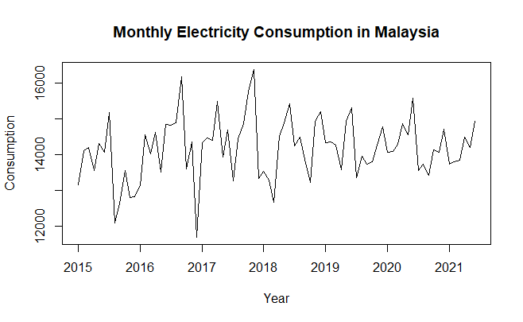
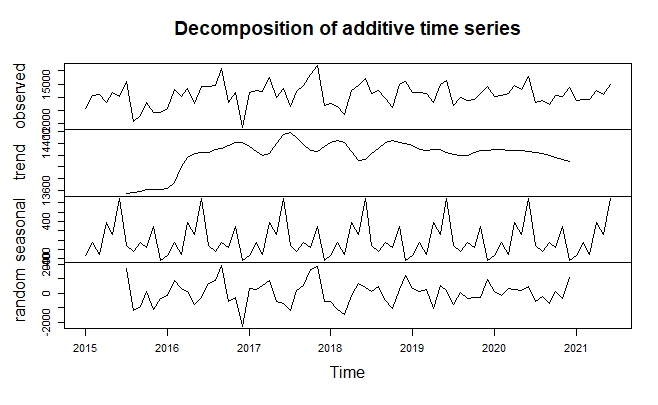
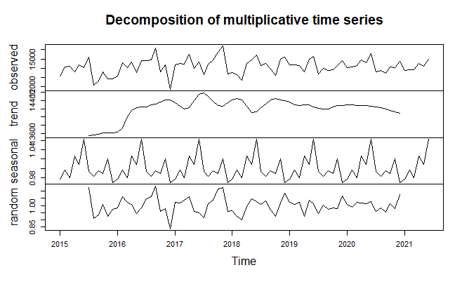
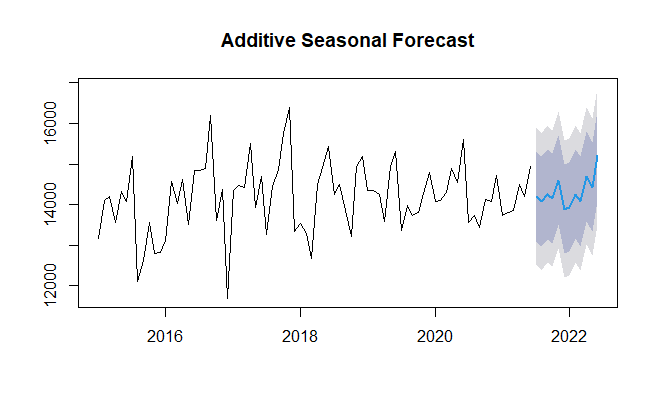
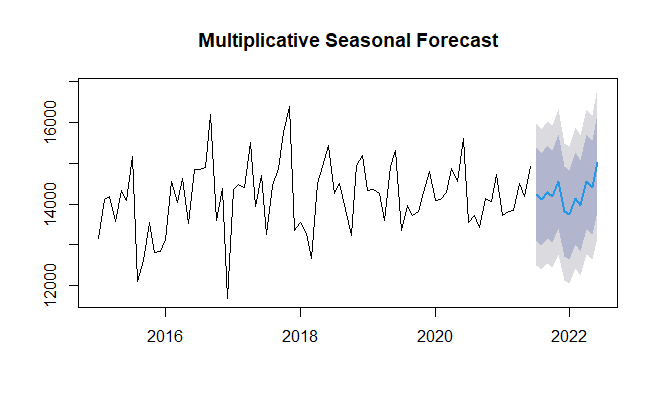
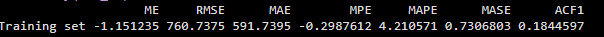
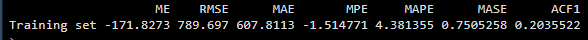

# Forecasting Malaysia’s Electricity Demand Using Time Series Analysis

**Author:** Daya Kumar  
[LinkedIn](https://www.linkedin.com/in/daya-kumar27/)


## Problem Statement
Rapid urbanisation and economic growth in Malaysia have driven a steady increase in electricity demand.  
Accurate forecasting of future consumption is critical for infrastructure planning, energy security, and sustainable urban development.

However, electricity demand is affected by both long-term growth and recurring seasonal patterns, making naive forecasting unreliable.

This project addresses this challenge by applying time series analysis to model historical electricity consumption and produce reliable short-term forecasts.

---

## Solution Approach
Using monthly electricity consumption data from the Department of Statistics Malaysia (2015–2021), the following steps were performed:

1. Data cleaning and conversion into a structured time series  
2. Exploratory analysis to identify trend and seasonality  
3. Additive and multiplicative decomposition of the series  
4. Construction of seasonal forecasting models  
5. Model evaluation using MAE, RMSE, and MAPE  
6. Selection of the best-performing model for future prediction

---

## Analysis & Results

### 1️⃣ Raw Time Series: Trend & Seasonality


The series shows a strong upward trend, indicating increasing electricity demand over time.  
Clear recurring seasonal patterns are observed, confirming the need for seasonal time series models.

---

### 2️⃣ Additive Decomposition


The additive model separates the data into trend, seasonal, and remainder components.  
Seasonal effects appear relatively constant over time, which is suitable when seasonal variation does not grow with demand.

---

### 3️⃣ Multiplicative Decomposition


The multiplicative model shows seasonal effects increasing proportionally with the level of the series.  
This behaviour reflects real electricity usage patterns more accurately, as higher demand leads to larger seasonal fluctuations.

---

### 4️⃣ Additive Forecast (12 Months)


The additive forecast projects steady growth with constant seasonal effects.  
However, it may underestimate variability as overall demand increases.

---

### 5️⃣ Multiplicative Forecast (12 Months)


The multiplicative forecast captures both rising demand and expanding seasonal variation, producing a more realistic representation of future electricity consumption.

---

##  Model Evaluation

### 🔢 Additive Model – Forecast Accuracy


The additive model was evaluated using the following metrics:

- **MAE** (Mean Absolute Error)  
- **RMSE** (Root Mean Squared Error)  
- **MAPE** (Mean Absolute Percentage Error)

The results indicate strong predictive performance, with low error values and **MAPE below 5%**, demonstrating reliable short-term forecasting.

---

### 🔢 Multiplicative Model – Forecast Accuracy


The multiplicative model was evaluated using the same accuracy metrics.  
Although its numerical error values are slightly higher than the additive model, it better captures the increasing seasonal variability observed in the data.

---

###  Final Model Selection

While the additive model shows marginally lower error values, the **multiplicative seasonal model** was selected as the final model because it more accurately represents the real-world behavior of electricity consumption, where seasonal fluctuations grow with increasing demand.


---

## Impact & Use Case
The resulting forecasts support:
- Energy infrastructure investment decisions  
- Power generation and grid expansion planning  
- Sustainable urban development policy formulation  
- Risk reduction related to electricity shortages and inefficiencies

---

## Dataset
- **Source:** Department of Statistics Malaysia  
- **Period:** 2015–2021  
- **Frequency:** Monthly  
- **Unit:** Gigawatt-hours (GWh)

---

## Tools & Libraries
- R, RStudio  
- forecast, ggplot2, tseries

---

## 📂 Repository Structure

```text
electricity-timeseries-malaysia/
├── data/
│   └── electricity_consumption.csv
├── code/
│   └── analysis.R
├── outputs/
│   ├── raw_timeseries.png
│   ├── additive_decomposition.png
│   ├── multiplicative_decomposition.png
│   ├── additive_forecast.png
│   ├── multiplicative_forecast.png
└── README.md
```


